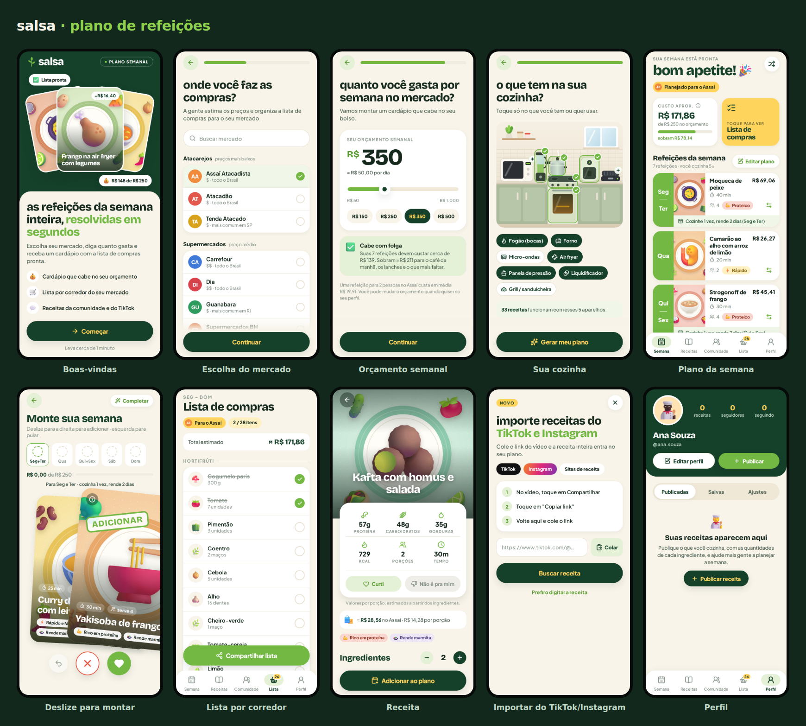
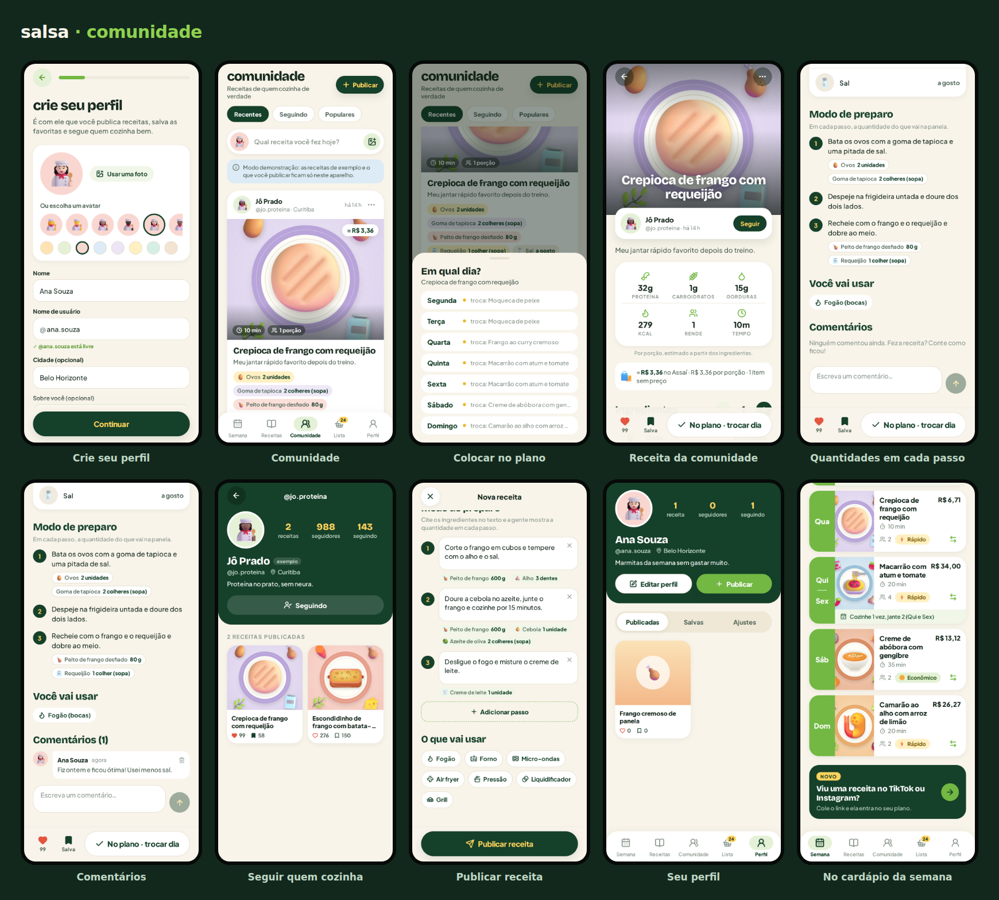

# salsa — plano de refeições

App mobile (iOS e Android), feito com Expo e React Native, que monta as refeições da semana de acordo com o **mercado** onde você compra, o **orçamento** semanal e os **aparelhos** que você tem em casa. Ele também gera a lista de compras organizada por corredor.

Cada pessoa tem um **perfil** e pode publicar suas receitas na **comunidade**, sempre com a quantidade de cada ingrediente, que aparece também dentro de cada passo do preparo. Quem vê pode curtir, comentar, **salvar** e **colocar a receita no cardápio da semana** com um toque (a lista de compras se atualiza sozinha).

A ideia segue o app Herbi (plano semanal, "deslize para montar a semana", importação de receitas do TikTok/Instagram e lista por corredor), com nome, identidade visual, receitas e preços próprios para o Brasil.





## Telas

**Onboarding**

1. **Boas-vindas**
2. **Crie seu perfil** — nome, @usuário (sugerido a partir do nome, com checagem de disponibilidade), foto ou avatar, cidade e bio. Com servidor configurado, também e-mail e senha ("Criar conta" / "Já tenho conta").
3. **Onde você faz as compras?** — escolha do mercado (Assaí, Atacadão, Carrefour, Pão de Açúcar, Dia, Guanabara… ou "outro mercado"), com busca e faixa de preço ($, $$, $$$).
4. **Pra quantas pessoas você cozinha?** — pessoas, refeições por semana (uma principal por dia, almoço ou jantar), "cozinhar em dobro" e preferências (vegetariano, sem lactose, sem glúten, mais proteína, menos carboidrato).
5. **Quanto você gasta por semana no mercado?** — orçamento com controle deslizante, valores rápidos e um aviso se o valor cabe, fica apertado ou é baixo para o mercado escolhido.
6. **O que tem na sua cozinha?** — cozinha ilustrada: toque em fogão, forno, micro-ondas, air fryer, panela de pressão, liquidificador e grill.
7. **Montando sua semana…**

**App**

- **Semana ("bom apetite!")** — custo aproximado × orçamento, atalho para a lista, a refeição de cada dia com preço, tempo, porções e o aviso "cozinhe 1 vez, rende 2 dias". Ainda tem trocar receita (⇄), gerar outro plano e ajustar ao orçamento.
- **Monte sua semana** — deslize para a direita para adicionar e para a esquerda para pular. Tem desfazer e "completar automaticamente".
- **Lista de compras** — agrupada por corredor, com quantidades já somadas, itens para marcar, total estimado, itens extras e compartilhamento.
- **Receita** — proteína, carboidratos, gorduras, kcal, porções e tempo, botões "Curti" e "Não é pra mim", ingredientes que se ajustam ao número de porções, modo de preparo com a quantidade de cada ingrediente embaixo do passo em que ele é usado e o botão "Adicionar ao plano".
- **Importar do TikTok e Instagram** — cole o link. No TikTok, a legenda é lida pelo oEmbed público e os ingredientes são reconhecidos automaticamente. No Instagram, que exige login, você cola ou digita a receita, e o app calcula preço e calorias.
- **Receitas** — busca e filtros (inclusive "Da comunidade": as que você salvou ou colocou no plano).
- **Comunidade** — feed com filtros Recentes, Seguindo e Populares. Cada post mostra autor, foto, tempo, porções, custo estimado no seu mercado e os ingredientes com as quantidades. Dá para curtir, comentar, salvar e tocar em **Plano** para escolher o dia da semana. No menu "⋯": ver perfil, não mostrar a receita, bloquear o autor ou denunciar.
- **Post da receita** — foto, autor com botão Seguir, macros, custo, ingredientes que se ajustam às porções, passos com as quantidades intercaladas, aparelhos e comentários.
- **Publicar receita** — foto (galeria ou câmera), nome, descrição, tempo, porções, ingredientes com quantidade e unidade (g, kg, ml, L, unidade, colher, xícara, dente, maço, lata, pitada, a gosto), "Colar lista" que separa quantidade e unidade de cada linha, passos (com prévia das quantidades de cada passo) e aparelhos.
- **Perfil** — seus dados, receitas publicadas, seguidores e seguindo, com as abas **Publicadas**, **Salvas** e **Ajustes** (mercado, orçamento, casa, cozinha, novo plano, sair da conta e recomeçar). O perfil de outras pessoas mostra as receitas delas e o botão Seguir.

## Como rodar no celular

Você precisa de um computador com **Node.js 20+** e do app **Expo Go** no celular (App Store ou Play Store).

```bash
npm install
npx expo start
```

Escaneie o QR code que aparece no terminal: no iPhone, com a câmera; no Android, pelo Expo Go. O computador e o celular precisam estar na mesma rede Wi-Fi. Se não estiverem, use `npx expo start --tunnel`.

Para ver no navegador (em uma moldura de celular): `npx expo start --web`.

Para publicar nas lojas, use o EAS: `npx eas-cli@latest build` e `npx eas-cli@latest submit`.

## Como funciona

- **Preços** — `src/data/ingredients.ts` tem ~80 ingredientes com preço médio em R$, corredor e informação nutricional. Cada mercado em `src/data/markets.ts` tem um índice de preço (atacarejos mais baratos, premium mais caros). Os valores são estimativas para planejamento, não preços reais de loja.
- **Plano** — `src/lib/planner.ts` filtra as receitas pelos aparelhos e preferências, evita repetir a mesma proteína, prefere receitas que rendem marmita nos dias "em dobro" e troca as mais caras até caber no orçamento.
- **Lista** — `src/lib/shopping.ts` soma as quantidades de todas as receitas, arredonda para o que se compra (unidades inteiras, gramas em múltiplos de 10/50/100) e agrupa por corredor.
- **Macros** — calculados a partir dos ingredientes de cada receita (por porção).
- **Dados** — o plano, a lista e as preferências ficam no próprio aparelho (AsyncStorage). As receitas da comunidade que você salva ou coloca no plano também ganham uma cópia local, para funcionar sem internet e entrar nas sugestões do plano.
- **Comunidade** — `src/social/` define uma interface (`SocialBackend`) com duas implementações: **demonstração** (tudo no aparelho, com 6 perfis e 10 receitas de exemplo) e **Supabase** (contas, banco Postgres e fotos). A escolha é automática: com as variáveis do `.env` preenchidas, o app usa o servidor.

## Comunidade com servidor (Supabase)

Sem configuração, a comunidade roda em **modo demonstração**: dá para testar tudo, mas o que você publica fica só no seu aparelho. Para que as pessoas vejam as receitas umas das outras:

1. Crie um projeto em [supabase.com](https://supabase.com).
2. No **SQL Editor**, rode o arquivo `supabase/migrations/20260929120000_comunidade.sql` (ou, com a CLI do Supabase vinculada ao projeto, `npx supabase db push`). Ele cria as tabelas (perfis, receitas, curtidas, salvas, comentários, seguidores e denúncias), os contadores automáticos, as regras de segurança (RLS: cada pessoa só altera o que é seu, e as receitas salvas são privadas) e o bucket `recipe-photos` para as fotos.
3. Copie `.env.example` para `.env` e preencha a URL e a chave pública `anon` (Project Settings → API).
4. Em **Authentication**, nas opções do provedor **Email**, deixe a confirmação de e-mail ligada (o app avisa para confirmar e depois entrar) ou desligue durante os testes.
5. Rode `npx expo start` de novo. Para builds pelo EAS, cadastre as mesmas duas variáveis nas variáveis de ambiente do projeto no expo.dev.

## Estrutura

```
App.tsx                  fontes, splash, navegação
src/navigation/          pilha raiz, abas e tipos das rotas
src/screens/             telas (onboarding/ e principais)
src/components/          botões, cartões, cozinha ilustrada, cartão deslizante…
src/data/                mercados, ingredientes, receitas, aparelhos
src/lib/                 plano, preços, lista, importação, formatação
src/store/               estado (zustand + AsyncStorage)
src/social/              comunidade: tipos, backend demo e Supabase, hooks (React Query)
supabase/migrations/     banco da comunidade (tabelas, RLS, gatilhos, bucket de fotos)
scripts/generate-assets.mjs   gera capas, ícones e o ícone do app
```

## Ilustrações

As capas das receitas e os ícones de ingredientes são gerados por `npm run assets` a partir do [Fluent Emoji](https://github.com/microsoft/fluentui-emoji) (Microsoft, licença MIT), com alguns pratos desenhados no mesmo estilo. Para usar fotos reais, preencha `imageUrl` na receita ou troque os arquivos em `assets/recipes/`.

## Próximos passos sugeridos

- Aparecer no menu **Compartilhar** do TikTok/Instagram (share extension). Isso exige um development build, por exemplo com `expo-share-intent`.
- Preços reais por parceria ou API dos mercados.
- Fotos reais das receitas.
- Notificações de curtidas, comentários e novos seguidores.
- Painel de moderação para as denúncias (hoje elas ficam na tabela `reports`).
- Sincronizar também o plano e a lista entre aparelhos.
